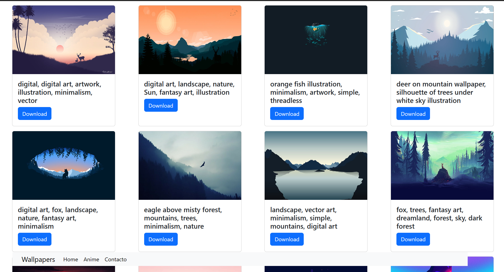

# SiteWallpapers

## Instalación

1. Descargar el repositorio: `git clone https://github.com/luisangelponcealvarez/SiteWallpapers`
2. Instala dependencias: npm install
3. Ejecuta el servidor: npm run dev esto posisionara en el http://localhost:3000/
4. Para poder subir cambios necesitarias ponerte en contacto con migo en https://luisangelponcealvarez.netlify.app/Contact
5. cual quier cambio que quieran subir madar lo a la rama deployments

## Miniatura

